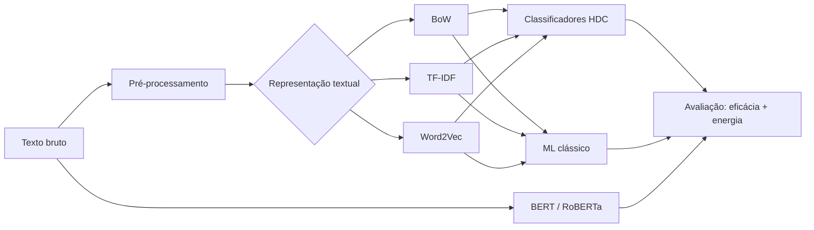

# Hyperdimensional Computing para Detecção de Fake News

**Uma abordagem de alta eficiência em dados de larga escala**

Dissertação de Mestrado — Programa de Pós-Graduação em Computação (PPGC), Instituto de Computação, Universidade Federal Fluminense (UFF), 2026.

**Autor:** Naoki Yokoyama
**Orientador:** Prof. Dr. Leandro Santiago de Araújo

---

## Sobre

Este repositório contém o código e os resultados da dissertação que investiga a **Computação Hiperdimensional** (*Hyperdimensional Computing* — HDC) como paradigma alternativo para a detecção automática de *fake news*.

O estado da arte da área é dominado por *Transformers* e *Large Language Models*, que alcançam alta acurácia a um custo computacional e energético elevado. Esta pesquisa avalia se classificadores hiperdimensionais — baseados em vetores de alta dimensão e operações algébricas leves — oferecem um *trade-off* favorável entre acurácia preditiva e eficiência energética.

### Hipótese

> A Computação Hiperdimensional oferece um *trade-off* favorável entre acurácia preditiva e eficiência energética na detecção de *fake news* em larga escala, mantendo desempenho competitivo em cenários balanceados e reduzindo o consumo computacional em ordens de magnitude em relação a arquiteturas *Transformer*.

A hipótese **não** é que o HDC supere os *Transformers* em acurácia absoluta, mas que ele ofereça acurácia aceitável a uma fração do custo.

---

## Pipeline



---

## Conjuntos de dados

| Dataset | Total | Real | Fake | Teste (30%) | Característica |
|---|---:|---:|---:|---:|---|
| **ISOT** | 44.267 | 21.416 | 22.851 | 13.281 | Balanceado, textos longos |
| **COVID-19** | 5.975 | 4.532 | 1.443 | 1.793 | Desbalanceado (≈ 3:1), textos curtos |
| **FEVER** (binarizado) | 109.809 | 80.034 | 29.775 | 32.943 | Larga escala, *claims* curtos |
| **Total** | **160.051** | 105.982 | 54.069 | | |

- **ISOT** — Ahmed, Traore e Saad (2017). Fusão de `True.csv` e `Fake.csv`, com remoção de duplicatas.
- **COVID-19** — Versão consolidada na linhagem de Patwa et al. (2021). Difere do *release* original, que é aproximadamente balanceado.
- **FEVER** — Thorne et al. (2018). Partição de treino (145.449 *claims*), descarte da classe `NOT ENOUGH INFO` (35.639), mapeamento `SUPPORTS → real` e `REFUTES → fake`, e deduplicação por hash SHA-256. Configuração *claim-only*, sem recuperação de evidências — os resultados **não** são comparáveis aos do FEVER *shared task*.

Os datasets não são redistribuídos neste repositório. Consulte as fontes originais.

---

## Metodologia

### Pré-processamento

Aplicado de forma uniforme a todos os modelos, exceto os *Transformers*, que usam seu tokenizador nativo:

1. Remoção de URLs, tags HTML, menções (`@`) e *hashtags*
2. Conversão para minúsculas
3. Remoção de *stopwords* (NLTK, inglês)
4. *Stemming* (Porter Stemmer)

### Representações textuais

| Representação | Configuração |
|---|---|
| **Bag of Words** | Vocabulário limitado aos 10.000 termos mais frequentes |
| **TF-IDF** | Vocabulário limitado aos 10.000 termos |
| **Word2Vec** | `GoogleNews-vectors-negative300`; vetor do documento = média dos vetores das palavras |

### Codificação hiperdimensional

Os vetores de entrada são projetados para o hiperespaço pelos **codificadores internos da biblioteca [torchhd](https://github.com/hyperdimensional-computing/torchhd)**. Esse codificador **não é uniforme** entre as variantes:

| Variante | Codificador torchhd | Técnica |
|---|---|---|
| Vanilla HDC | `Random` + `Level` | *Record-based encoding* |
| AdaptHD | `Random` + `Level` | *Record-based encoding* |
| OnlineHD | `Sinusoid` | Projeção aleatória não linear |
| NeuralHD | `Sinusoid` | Projeção aleatória não linear |
| DistHD | `Projection` | Projeção aleatória linear |

Nenhuma variante usa codificação de N-gramas ou permutação. Os classificadores HDC recebem, portanto, exatamente a mesma informação que os modelos de Aprendizado de Máquina clássico.

### Modelos avaliados

| Família | Modelos |
|---|---|
| **HDC** | Vanilla HDC, AdaptHD, OnlineHD, NeuralHD, DistHD |
| **ML clássico** | Logistic Regression, SVM, Random Forest, Árvore de Decisão, KNN |
| **Transformers** | BERT (`bert-base-uncased`), RoBERTa (`roberta-base`) |

### Hiperparâmetros

| Parâmetro | Valor |
|---|---|
| Dimensionalidade D (HDC) | 1.000 e 3.000 |
| Épocas (HDC e Transformers) | 2 |
| ML clássico | Parâmetros padrão do scikit-learn |
| Transformers | *batch* 16, *learning rate* 2e-5 (AdamW), `max_length` 512 |
| Divisão treino/teste | 70/30, estratificada, `random_state = 42` |

### Estimação de energia

```
E (Wh) = TDP × t / 3600
```

com TDP = 70 W (NVIDIA Tesla T4) e `t` = tempo de treinamento em segundos. É uma estimativa de **limite superior**, que superestima o consumo de modelos leves que não saturam a GPU.

### Ambiente

- Google Colab Pro — GPU NVIDIA Tesla T4 (16 GB VRAM), 12 GB RAM, Intel Xeon (2 vCPUs)
- Python 3.10
- torchhd, scikit-learn, HuggingFace Transformers

---

## Resultados

### Comparação final — F1-Score (%) com Word2Vec, HDC em D = 3.000

| Dataset | Melhor HDC | Melhor ML clássico | BERT | RoBERTa |
|---|---:|---:|---:|---:|
| **ISOT** | 94,68 (OnlineHD / DistHD) | 95,66 (SVM) | **99,80** | 99,74 |
| **COVID-19** | 70,04 (OnlineHD) | 68,22 (SVM) | **83,24** | 81,55 |
| **FEVER** | 53,62 (NeuralHD) | 49,09 (Log. Regression) | **70,09** | 69,35 |

### Eficiência — modelo representativo de cada paradigma

| Dataset | Modelo | F1 (%) | Tempo (s) | Energia (Wh) | Redução vs. BERT |
|---|---|---:|---:|---:|---:|
| **ISOT** | OnlineHD + W2V | 94,68 | 3,72 | 0,073 | **≈ 1.161×** |
| | Logistic Regression + W2V | 94,68 | 0,50 | 0,010 | |
| | BERT | 99,80 | 4.357,80 | 84,73 | |
| **COVID-19** | OnlineHD + W2V | 70,04 | 6,58 | 0,13 | **≈ 18×** |
| | Logistic Regression + W2V | 66,67 | 0,04 | 0,0008 | |
| | BERT | 83,24 | 123,60 | 2,40 | |
| **FEVER** | OnlineHD + W2V | 44,54 | 119,80 | 2,33 | **≈ 21×** |
| | Logistic Regression + W2V | 49,09 | 1,08 | 0,021 | |
| | BERT | 70,09 | 2.532,40 | 49,24 | |

### Principais achados

1. **Os Transformers preservam a maior eficácia** em todos os cenários.
2. **No cenário balanceado (ISOT), o HDC fica a cerca de 5 pontos do BERT** com consumo energético aproximadamente 1.161 vezes menor.
3. **Nos cenários desbalanceados, o HDC supera o ML clássico por margem modesta** — 1,82 ponto no COVID-19 e 4,53 no FEVER —, sem confirmar a "robustez intrínseca ao desbalanceamento" reivindicada na literatura.
4. **D = 3.000 supera D = 1.000** em 39 de 45 comparações (F1 médio de 64,73% contra 61,14%).
5. **Word2Vec conduz o HDC ao melhor desempenho médio** (72,78% de F1 do melhor HDC por dataset, contra 71,26% do BoW e 69,31% do TF-IDF).
6. **O AdaptHD apresenta instabilidade reproduzível** em duas configurações (FEVER · BoW · D = 1.000 e ISOT · Word2Vec · D = 3.000), degenerando para previsão de classe única.

---

## Limitações

- **Codificadores heterogêneos entre variantes HDC.** As diferenças entre variantes refletem simultaneamente a estratégia de aprendizado e o codificador, sem que seja possível isolar os dois efeitos. A comparação entre paradigmas não é afetada.
- **AUC a partir de rótulos rígidos.** Para HDC e ML clássico, o AUC equivale à acurácia balanceada e a curva ROC reduz-se a um único ponto de operação. Apenas BERT e RoBERTa têm AUC por varredura de limiar.
- **Energia estimada por TDP**, e não medida diretamente (NVML / CodeCarbon).
- **Hardware único** (Tesla T4). A execução em CPU, FPGA ou *hardware* neuromórfico não foi avaliada.
- **Dimensionalidade limitada** a D ≤ 3.000 por restrição de memória; a literatura costuma usar D = 10.000.
- **Semente única** (`random_state = 42`), sem desvio-padrão nem teste de significância.
- **Possível viés estilístico no ISOT**: a classe "real" vem concentrada da Reuters.

---

## Como reproduzir

```bash
git clone https://github.com/<seu-usuario>/<seu-repositorio>.git
cd <seu-repositorio>

python -m venv .venv
source .venv/bin/activate

pip install torch torch-hd scikit-learn transformers gensim nltk pandas numpy matplotlib
```

> O pacote no PyPI chama-se `torch-hd`; o import é `import torchhd`.

Baixe os datasets nas fontes originais e o modelo `GoogleNews-vectors-negative300` para o Word2Vec.

<!-- Ajuste os comandos abaixo aos nomes reais dos seus scripts -->
```bash
python preprocess.py        # ingestão, normalização e pré-processamento
python run_hdc.py           # variantes HDC em D ∈ {1000, 3000}
python run_classic.py       # baselines de ML clássico
python run_transformers.py  # fine-tuning de BERT e RoBERTa
```

---

## Estrutura do repositório

<!-- Sugestão — ajuste à organização real do seu código -->
```
.
├── data/              # datasets (não versionados)
├── notebooks/         # experimentos no Google Colab
├── src/
│   ├── preprocessing/
│   ├── encoders/      # BoW, TF-IDF, Word2Vec
│   ├── models/        # HDC, ML clássico, Transformers
│   └── evaluation/    # métricas e estimação de energia
├── results/           # tabelas e matrizes de confusão
├── figures/           # figuras da dissertação
└── README.md
```

---

## Citação

```bibtex
@mastersthesis{yokoyama2026hdc,
  author  = {Yokoyama, Naoki},
  title   = {Hyperdimensional Computing para Detecção de Fake News:
             Uma Abordagem de Alta Eficiência em Dados de Larga Escala},
  school  = {Universidade Federal Fluminense},
  address = {Niterói, RJ, Brasil},
  year    = {2026},
  type    = {Dissertação de Mestrado},
  note    = {Programa de Pós-Graduação em Computação}
}
```

Artigo derivado: *Hyperdimensional Computing for Fake News Detection: A High-Efficiency Approach for Large-Scale Data* — ENIAC 2026.

---

## Licença

<!-- Defina a licença do repositório (por exemplo, MIT) -->
A definir.

---

## Agradecimentos

Ao Prof. Dr. Leandro Santiago de Araújo, pela orientação, e ao Instituto de Computação da UFF.
